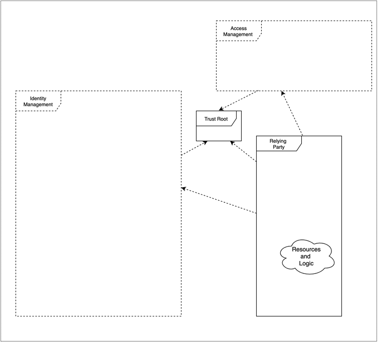
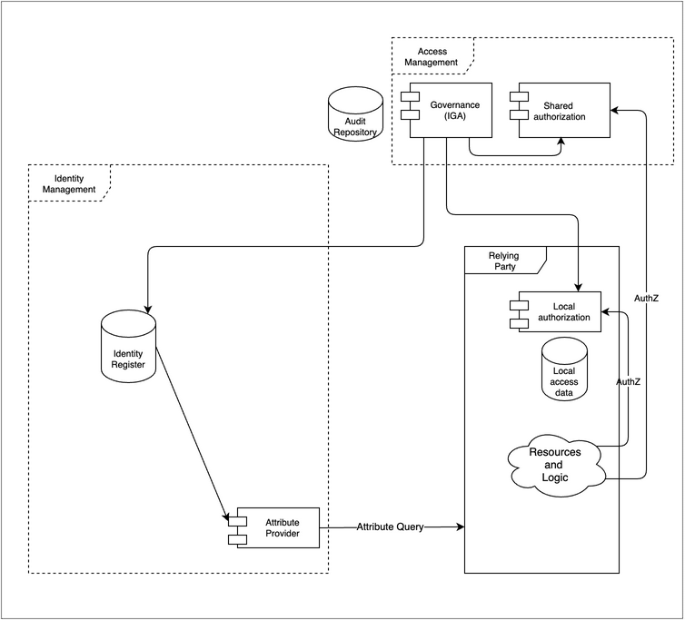

# Technical Architecture Model
## Abstract
This document provides a model to organize the presentation of technical details associated with various implementations of the architectural concepts.  This article provides the set of generic components which are exemplified in subsequent articles with focus on specific technical use-cases. Each such use-case will indicate which of the abstract components are involved in a particular implementation.
During the draft phase of this document an appendix is provided to elaborate on that these use-case might be and look like.

The model is a restatement/extension of the ISO/IEC framing. It is simplified to remove the UML fine points, which the typical reader, may not find helpful. And it is extened so that authorization, governance and risk-control can be included. 

The model has been compared to the FICAM, Internet 2, and NIST Zero Trust models.  This comparision caused the author to make some useful adjustments.

## Introduction
The following is the basic organization of an identity management system, which supports multiple relying services.

The most basic function of the identity system is to provide secure storage of the information about identities and a way for relying services to use that data to control access to resources.  The audit repository is shown since that is perhaps one of the most salient aspects of providing that security. 

While, it is possible to have an identity management system without attaching it to external data, this is typically not the case. Usually employee or customer data needs to be imported.

The model can be used at different levels.  For instance, a modern architecture may have a web-hosted application that calls on an Identity as a Service (IDaaS) cloud provider, which acts as the Identity Management System.  

In another example, a file system grants access to users based on the user information acquired at login.  Despite both the file system and the identity management function being encapsulated in an operating system, the model holds.

We will add on more detail during the next several sections.

## Terminology

|Term (long)|Term (short) | Definition |
|---|---|---|
|Identity Management System | IMS | A set of policies, procedures, technology, and other resources for maintaining identity information.  In this model it contains information about princpals/subjects including credentials.  It also including other data such as meta data to enable interoperability with other components.|
|Relying Service|RS|A component, system or application that uses the IMS to identify its users. The RS has its own resources and logic. This roughly corresponds to the Agency Endpoint in the FICAM model, to Identity Consumers in the Internet2 model.|
|Authoritative Sources|AS|This represents one or more data sources that are used to by the IMS as the basis for the master set of principal/subject records. Each AS may supply a subset of records and a subset of attributes.  This corresponds to Identity Information Source in ISO/IEC 24760-2, and Identity Sources in Internet 2|
|Principal & Credential Mgmt|PCM|This follows the ISO model where the proofing, credentialing, and lifecycle aspects are considered a subfunction of the IMS.  FICAM separates this into a first class component called Credential Management System, which also includes PKI information for federation, which this model indicates under metadata and discovery.|
|Authentication|AuthN|The act of determining that the principal/subject is authentic to a level of assurance.  In this model this is shown as a collaborative activity between the IMS and the RS. The FICAM model, at a more abstract level, includes this in the first class component called Access Management.|
|Session|Sess|A period of time after an authentication event when an RS grants access to the principal/subject.|
|Authorization|AuthZ|Authorization is how a decision is made to allow someone to access a resource. This is not included in the ISO or Internet 2 models.  The FICAM includes this as a subcomponent of the Access Management System. This model is more explicit about the location of the implementation of the authorization |
|Access Governance|AG|Access Governance provides oversight and control over access rights implemented in many local or shared authorization systems.  This roughly corresponds to the Access Certification section of the first class component Governance Systems in the FICAM model. AG is not included in the ISO/IEC model.|
|Risk Context|RC|Risk Context consists of additional facts that can be brought to bear to improve the overall security of the ecosystem. Internal or external events and facts can be applied to enable, limit, or terminate access.  This is similar to the section Monitors and Sensors under FICAM's Governance Systems, and, NIST 800-207 (Zero Trust) to many of the inputs of the Policy Decsion Point as shown in Figure 2.|
|Metadata|meta|Control data that allows the Identity Management System to recognize and trust the Relying Service.  This corresponds to Relying Party data in the Internet 2 model.|

## Provisioning
Provisioning describes how the data gets into the identity repository and how it flows further on to support authorization decisions.

Note that the Authoritative Source can be singular, such as a single HR system.  Or it can plural, for instance in the case of a company that has, say, more than one HR system.  

Also note, that the notion of importing does not necessarily mean making a physical copy of data, although it often does. The notion also supports the idea of virtualization - where the import of identity information is done at run-time.

The Identity Register could be implemented several ways.  Common methods include the use of general purposed databases, optimized stores such as directories and, as mentioned above, virtual directories.

Shown also, here is the function Principal and Credential Management.  This is intended to include steps needed to orginate and identity (such as proofing or vetting) as well as on-going maintenance such as password reset and other credential management activities such as token provisioning.  This function includes administrative activities and self-serve activities.

Also noted is the function of propagating selected information further into the ecosystem.  This is typically done for relying services that need additional information about the users, often for the purpose of access control or personalization.  The assumption is that the relying system makes a copy of the identity data and integrates it with application data.  Of course, a complete solution will allow for the full lifecycle including creation, update and eventual dispostion of the identity data stored locally.

Not shown here, but sometimes implemented, are provisioning actions that occur more on a just-in-time basis.  This can happen based on an assertion that the user is authenticated.  In this case identity information, possibly including, attributes is passed on to the relying system "just-in-time".  In a similar case, the relying party, may query the indenty management system, in order to acquire attributes.

## Authentication and sessions
By authentication we mean that the Idenity Management System checks and verifies credentials that are presented by the Relying Service on behalf of the user.  There are many such scenarios.  

A common pattern is to associate the authentication event with the start of a session.  The session is mostly the concern of the relying system.  However, it is sometimes desirable to keep the sessions supported by several relying parties in synch. For instance, logging out of one, logs out of all.  To do this, often the Identity Management System plays a role.

The session can play an important role in step-up authentication.  The session can keep track of the level of assurance of a particular authentication, so when a relying service has a sensitive transaction needing step-up authentication, the identity management system can be prepared to determine the course of action.  This could be done at the relying system, but that would end up with a poor user experience if multiple relying systems with step-up needs were in play.

The existence of a centralized point of view about sessions, can be leveraged to support good security practices. For example, if session management becomes aware of a terminated account it could end an active session. This could also occur in advanced scenarios which include external risk facts. See Risk Context below.

## Authorization 
Authorization models vary alot. The diagram shows two alternative approaches for authorization.

Both approaches typically use subject attributes help determine access.  These values can be provisioned into a local store, as described above in Provisioning.  Or the values can be acquired at run-time from the Identity Management System as shown by the attribute query.

Many relying services perform authorization tasks internally.  The local nature of the protected resources often makes this appealing.  

Sometimes authorization is a shared resource for many relying services.  This design can improve consistency of authorization decisions and it allows a feasible way for organizations to include advanced access decisions strategies such as "Zero Trust" as described by NIST 800-207.

## Access governance
Access Governance provides oversight and control over access rights implemented in many local or shared authorization systems.  Both of these may rely on user attributes such as groups or roles stored in an Identity Register. 

Typically, goverance activities review and may modify the data in one or more of the authorization components in order to effect a change in entitlements.

This is frequently implemented in enterprise systems focusing of employee/contractor entitlements.  However, the concept can also apply to customer facing scenarios such as business to business delegated rights or business to customer scenarios where delegation such as power of attorney or other agents are implemented.

## Risk Context
Risk context information can be valuable to improve the security of the relying service.  External events may be visiable to the Identity Management System operator through consortia or vendor packages.  In some mutual-support scenarios, it may be possible for the operator to also publish events for the benefit of others.

Events need to be delivered into the Identity Management System so that they can selectively be used to modify the behavior of the authentication function.  In some severe scenarios it may be desirable to attach the events to the session management function so that current sessions can be reviewed and terminated if needed.

The diagram also shows that shared authorization systems may consume risk data as well.  For example an authorization might be denied if the subject's recent history is outside of normal bounds, indicating a compromised credential. Logically this could happen with local authorization as well, but it may be harder to get that implemented and so is not shown.

The linkage from the IMS Audit Repository is intended to show that the Risk Contex consumes that as one of many inputs to the trust algorithm. (see NIST 800-207).

## Metadata and Discovery
Metadata here is meant to convey the idea of control data that allows the Identity Management System to recognize and trust the Relying Service.  The inverse is also true, but the metadata of the Relying System is not shown. This may include information that limits the types of interactions and scope of data that is exchanged.  It also frequently contains security information to allow the counterparties to authenticate each other.  For instance public key components such as certificates with a common trust root are frequently used.

Discovery [Need help here]

## References
1. ISO/IEC 24760-2:2015(E) 
2. FICAM https://playbooks.idmanagement.gov/arch/components/
3. Internet 2 https://playbooks.idmanagement.gov/arch/components/
4. NIST Zero Trust https://nvlpubs.nist.gov/nistpubs/SpecialPublications/NIST.SP.800-207.pdf

## Appendix - Use Cases
This appendix will be removed once use-case list is finalized and first few are written.

Each article describes a single use-case as implemented in a particular architecture to illustrate a set of components and how they are connected and interact to perform the use-case.  These articles are grouped by the functions defined in the model.

To retain context from  "Introduction to IAM Architecture," IDPro Body of Knowledge" the article will indicate what architecture type(s) the use case applies to.

The use-case articles follow a common structure:

   - Use-case name
   - Architecture Type or types Host, Client-Server, N-tier, Hub & Spoke, Remote Access, Cloud Environments
   - Short description
   - Actors, components and connectors included (with a diagram).  
      - The components and connectors refer to the abstract architectural components and their implementations in this use-case.
   - Prerequisites
   - Exposition on how the components work together and some level of detail deemed by the author appropriate for the reader
   - Where to find more information on this and adjacent use-cases

Example: of a use-case.  This example is chosen to indicate how constrained these articles are intended to be.  There could be quite a few variations on Windows login.  

   Name: Employee logs in to Windows domain - Kerberos
   Short Description: Interactive domain login using password (Kerberos)
   Architecture Type: Client-Server
   Description: An existing employee logs into the corporate Windows environment with a password.
   Actors/Components: User (employee), network attached computer running Windows 10, Microsoft Active Directory (IDENTITY REGISTER),  Kerberos protocol (AUTHENTICATION)

### List of use-cases 

The list of use-case articles is intended to grow over time. [seeded 5/20/21 - discuss with cmte for more]

#### Function: Authentication

1. Employee logs in to Windows domain - Kerberos
1. Customer logs in from web browser - OpenID Connect
1. Cloud service authenticates via delegation - SAML

#### Function: Provisioning

1. Directory absorbs changed people information from HR - LDAP
1. Directory synchronizes with downstream resource - SCIM

#### Function: Attribute Exchange

1. Attributes are provided in assertion - SAML
2. Attributes are requested - OpenID Connect

#### Function: Authorization

1. File system authorizes access - Windows
2. Application authorizes based on attributes - custom
3. Application delegates to policy service - OAuth
4. Cloud service authorizes based on role assumed from single signon - Cloud
