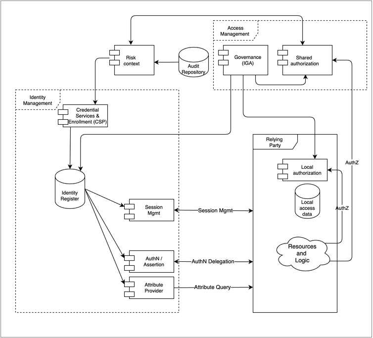

# IAM Reference Architecture Model

## Abstract

This article provides a reference model to organize the presentation of technical details associated with various implementations of identity and access management (IAM) architectural concepts. The model is conceptual, as are the set of abstract components which it provides. 

To move out of the conceptual realm into specifics additional articles follow, each with a focus on a specific technical use-cases. Each such use-case indicates which of the abstract components comprise a particular implementation 

The model is a started with the ISO/IEC framing [Note 1]. The UML detail has been removed for simplicity and the IAM model has been extended so that authorization, governance and risk-control can be included.

Some of the ISO/IEC names have been changed to reflect more common usage. In some cases, the ISO names have been used in a way that is more expansive than their definition.

The model has been reviewed in conjunction with the FICAM, Internet 2, NIST SP-800-63 definitions, and NIST Zero Trust frameworks and with the Identity Stack presented at Identiverse 2019 in an attempt to adopt the most useful terminology.

## Introduction

The following is the basic organization of an identity management system (IMS), supporting multiple relying services, or relying parties (RP).

{width="6.268055555555556in" height="4.636805555555555in"}

The most basic function of the identity system is to provide secure storage of the information about identities and a way for relying  parties, to use that data to control access to resources. Note that the term Relying Service is used by ISO/IEC to encompass all types of components that use identity services, including systems, sub-systems, and applications, independent of the domain or operator.  We will use the more common Relying Party (or RP).

The audit repository is shown since that is perhaps one of the most salient aspects of providing that security.

While, it is possible to have an identity management system that is populated without attaching to an external data service, this is typically not the case. Usually, employee or customer data needs to be imported.

The model can be used at different levels. Here are a couple of examples:
#### Example 1
A modern architecture may have a web-hosted application (the RP) that calls an Identity as a Service (IDaaS) cloud identity service, acting as the Identity Management System. The RP in this case could be a customer facing application or a workforce facing application.

#### Example 2
A computer's file system (RP) provides access control based on the user information acquired at login (IMS). Despite both the file system and the identity management function being encapsulated in an operating system, the model holds.

### Trust Anchor

This component represents the legal, organizational and technical apparatus that enables trust between the Identity Management System and the Relying Parties.  When the IMS and the RP are not in the same organization this may take on a salient aspect; when they are in the same organization the agreements may be more tacit.  When the IMS and RP are both built into a single system the root of trust my be hidden in the system internals.

#### Root of Trust

There is a need for a technical root of trust. This is done through a Public Key Infrastructure (PKI).  The parties agree to trust a common certificate authority which signs the certificates of all parties in the federation. 

#### Trust Framework

A trust framework is the set of rules and policies that govern how the federation members will operate and interact  [NISTIR 8149].  In simple cases this may be a contract between two parties.  In other cases it is the basis of a multilateral agreement. 

#### Interoperations

To operate well, the parties of a federation establish mutual agreement upon an acceptable identity to be used between the parties in a federated relationship (for instance the level of assurance used).  In addition, the definition and values of attributes of federated identities should be agreed.  The parties should agree on the security/access policies of federated users between the parties in a federated relationship.  For instance, are there duties to notifiy others in the event of security failures.

## Terminology

The terms are defined below and provided with abbreviations to facilitate reference in the use-cases.

### Identity Management System (IMS)

A set of policies, procedures, technology, and other resources for maintaining identity information. In this model it contains information about principals/subjects including credentials. It also including other data such as meta data to enable interoperability with other components.  The IMS is shown with a dotted line to indicate that it is a conceptual grouping of components, not a full fledged system in itself.

### Trust Anchor

This component represents the legal, organizational and technical apparatus that enables trust between the Identity Management System and the Relying Parties.  

### Relying  Party (RP)

A component, system or application that uses the IMS to identify its users. The RP has its own resources and logic. This is also known as the Relying Service in the ISO/IEC model. This roughly corresponds to the Agency Endpoint in the FICAM model, or to Identity Consumers in the Internet2 model.

### Identity Information Authority (IIA)

This represents one or more data sources that are used by the IMS as the basis for the master set of principal/subject identity records. Each IIA may supply a subset of records and a subset of attributes. Sometimes the IIA is distinguished from the Identity Information Provider or IIP.  Here we mean this term to include the service that actually provides the information as well as the root authority.   Here we use this term to include both. This corresponds to Identity Information Source in ISO/IEC 24760-2, and Identity Sources in Internet 2.

### Attribute Provider

A type of IIA. Sometimes the authority for attributes is distinguished from the authority for identities.  In this case the term Attribute Provider is sometimes used. 

### Enrollment 

Also known as Registration. Enrollment is concerned with  the proofing, and lifecycle aspects of the principal (or subject).  The entity that performs enrollment has sometimes been known as a Registration Authority, but we (following NIST) will use the term Credential Service Provider.

### Credential

A credential allows for authentication of an entity by binding an identity to an authenticator.  

### Credential Services

Credential Services  issue or register the subscriber authenticators, delivers  the credential for use, and subsequently manages the credentials.   FICAM separates this into a first-class component called Credential Management System, which also includes PKI information for federation.  We follow FICAM in this model: so the subscriber will include system components that need certificates and private keys.  

### Credential Service Provider (CSP)

Following NIST 800-63-3 we include both the enrollment function and credential services together under the name Credential Services Provider.

### Identity Register

This is the data store that contains the enrolled entities, and their attributes.  In this model we use the singular, as if it were one singular database.  In practice designs may store some attributes separate from identities. We also use this to include the storage related to credentials, although in practice, all or some of the credentials may be stored in their own physical repository.  Identity Registers by their nature have high availability requirements, so often at the physical level they contain multiple instances which are synchronized.  The term Attribute Store is sometimes used as a synonym.

### Authentication (AUTHN)

The act of determining that the principal/subject is authentic to a level of assurance. Depending on the architecture this function may also produce a security token to convey authentication information securely to the RP.

### Session (SESS)

A period of time after an authentication event when an RSVC grants access to the principal/subject.

### Authorization (AUTHZ)

Authorization is how a decision is made at run-time to allow someone to access a resource. This is not included in the ISO or Internet 2 models. The FICAM framework includes this as a subcomponent of the Access Management System and is more explicit about the location of the implementation of the authorization. 

### Entitlement

The artifact that allows access to a resource by a principal.  This is equivalant to privilege, access right, permission.  Sometimes it is called an authorization.  An etitlement can be implmented in a variety of ways.  

### Enforcement 

The mechanism that ensures an individual cannot perform an action or access a system when prohibited by policy. 

### Access Governance (IGA)

Access Governance provides oversight and control over access rights implemented in multiple local or shared authorization systems. These rights may be controlled in a variety of ways, starting with the existence and validity of the digital identity. Other controls include various mechanisms such as policies, the mapping of roles, permissions, and identies.  The abbreviation used is for Identity Governance and Administration and is commonly used in the commercial sector. This roughly corresponds to the Access Certification section of the first-class component Governance Systems in the FICAM model. IGA is not specifically addressed in the ISO/IEC model.

### Risk Context (RCTX)

Risk Context consists of additional facts that can be brought to bear to improve the overall security of the ecosystem. Internal or external events and facts can be applied to enable, limit, or terminate access. This is similar to the section Monitors and Sensors under FICAM\'s Governance Systems, and, NIST 800-207 (Zero Trust) to many of the inputs of the Policy Decision Point as shown in Figure 2.

### Metadata (META)

Control data that allows the Identity Management System to recognize and trust the Relying Service. This corresponds to Relying Party data in the Internet 2 model.

Provisioning
------------

Provisioning is a term that encompases the processes and methods that create, modify, and, eventually, delete the identity and profile information used by IT infrastructure and business applications. By these method, records are created, or updated in the identity repository, and removed from it.  Often, provisioing needs to extend to applications  to support authorization decisions.  The term "Onboarding" is sometimes used to refer to the sum of the initial provisioning activities, in both the identity and access aspects.

#### Identity Information Authorities

Note that the authoritative sources for identity attributes transcend the HR system and may include the email system, phone system, training certification etc. In some cases, a company may have more than one HR system.

The act of provisioning may include certain logic, best modeled as governance.  In some cases the IGA system actually takes on all the provisioning duties. 

#### Identity Register

The Identity Register could be implemented in several ways. Common methods include the use of general-purpose databases, optimized stores such directories i.e., a physical or a virtual directory.

Importing data does not necessarily mean making a physical copy of data, although it often does. The notion also supports the idea of virtualization - where the import of identity information is done at run-time.

Also noted is the function of propagating selected information further into the ecosystem. This typically occurs when a relying services needs additional information about the users, e.g. for the purpose of access control, or personalization. The relying system makes a copy of the identity data and that is used in the application processes. A complete solution will allow for the full lifecycle including creation, update and eventual deletion of the identity data stored locally.

#### Credential Services & Enrollment 

This function includes steps needed to originate and activate an identity. It is also concerned with on-going maintenance such as password reset and key rotation.  This function includes administrative activities and self-serve activities.

##### Enrollment

Also sometimes known as Registration. It involves such activities as proofing, verfication or vetting, and recording sponsorship, if needed.  It also is responsible for the secure delivery of credentials. Enrollment ends when a user formally receives ownership of their digital identity and assumes control/ownership of their account’s credentials. 

##### Credential Services

Credential service include the creation and binding of passwords, cryptographic keys and other authenticators. It is also concerned with on-going maintenance such as password reset and key rotation.  It also is in charge of revoking credentials as needed.

#### Just in Time

So far, the provisioning function is restricted to "admin-time".  However, there are some cases where provisioning occurs at run time. 

Not shown here, but sometimes implemented, are provisioning actions that occur on a just-in-time basis. This can happen when additional identity information is passed to a relying service in real-time to support a specific application requirement, possibly including identity attributes. A similar case involves the relying service querying the identity management system in order to acquire attributes (Shown under Authorization)

{width="6.268055555555556in" height="5.839583333333334in"}

## Authentication and sessions

Authentication is the process by which a subject's credentials are used to verify their identity. The Identity Management System checks and verifies credentials that are presented to it. There are multiple scenarios. Typically, the Relying Service presents the credentials on behalf of the user and receives an assessment from the IMS regarding the level of certainty that the user is authentic. Often the assessment (and more information about the user) is delivered to the RP via a security token, which is protected by cryptography. There are several varities of security tokens.  

A common pattern is to associate the authentication event with the start of a session. The session is mostly the concern of the relying system. However, it is sometimes desirable to keep the sessions supported by several relying parties in synch. For instance, logging out of one session will terminate concurrent sessions. To do this, often the Identity Management System will act to orchestrate sessions termination. In high security environments, session management must support termination based on real-time identity data such as when a user's entitlements have been modified.

The existence of a centralized point of view about sessions, can be leveraged to support good security practices. For example, if the identity attributes of a user with an active session changes and then contravenes an access control policy the session should terminate, or if session management becomes aware of a terminated account it should end any active session that the user has. This could also occur in advanced scenarios which include external risk facts. See Risk Context below.

Sessions also support another important concept: step-up authentication. A session can keep track of the level of assurance of a particular authentication, so when a user requests access to a transaction or application requiring a higher level of identity assurance, the Identity Management System can be prepared to determine the course of action, such as improving the certainty that the user is the right person by asking the user provide additional evidence.  For example, maybe the password is good enough to review some information but to withdraw money the additional factor of of a one-time password from a phone app is required. The detection of the assurance gap and subsequent action could be done at the relying system, but that would end up with a poor user experience if multiple relying systems with step-up needs were in play.

{width="6.268055555555556in" height="4.636805555555555in"}

## Authorization

Authorization models are many and diverse. The diagram illustrates two approaches for authorization.

Both approaches typically use subject attributes help determine access. These values may have been provisioned into a local store, in the Provisioning process described above. Or the values can be acquired at run-time from the Identity Management System as shown by the attribute query.

#### Local Authoriziation

Many relying services perform authorization tasks internally. Often the fine-grained access control required by a protected resource makes this appealing. For instance, a financial management system may maintain a user's entitlements to specific functionality with the application.  In this scenario the application makes the authorization decision and implements (enforces) the result.

#### Shared Authorization

Sometimes authorization is a shared resource for many relying services. This design can improve consistency of authorization decisions and supports organizations wishing to include advanced access decisions strategies such as those required by a \"Zero Trust\" access control approach, as described by NIST 800-207. Shared authorization systems typically have a consistent approach to policy such as a standardized policy language. In this scenario the application ask the shared authorization function to make the decision but implements (enforces) that itself.

#### Layers

This distinction between local and shared authorization is not precisely the same as that between the commonly used terms "coarse-grained" and "fine-grained" access control.  Consider a web-based application that is protected by a reverse proxy.  The user logs-in a the reverse proxy which determines which applications the user has access to.  The reverse proxy implements coarse grained access control only, since the it knows nothing about the fine-grained rules implemented by the application.  

### Authorization Mechanisms

In either approach, the access rights may be established, maintained and revoked in a variety of ways, starting with the existence and validity of the digital identity. Other controls include various mechanisms such as policies, the mapping of roles, permissions, and identities. Some controls rely on user attributes including group memberships or roles stored in an Identity Register. 

Each mechanism relies and a particular logical data structure to implement the access control and that data structure becomes and object of engineering, although it may seem that good results derive from both art and science.  For instance, in role based access control, there is some art involved "Role Management", or defining and managing a useful set of roles, since too many roles becomes difficult to manage and too few leads to users with access to things they don't need. Similarly, in the case of policy based access control the set of policies (the Policy Rules) needs to be stored and managed.

The process of setting up the system to allow for authorization is described in the next section (Access Governance).

{width="6.268055555555556in" height="5.809027777777778in"}

## Access governance (IGA)

Access Governance provides control over access rights implemented in multiple local or shared authorization systems. This control is often broken into the administration of these rights and the oversight needed to ensure that these rights are in good order over time.  While this is logically separate from Provisioning, some organizations find it useful to group IGA and Provisioning together under an organzational unit charged with both.

#### Control  

Broadly speaking, the controls may also include methods such as procedures and workflows to ensure proper review

Often deployed to prevent internal fraud is the control labeled segregation of duties.  The control defines groups of access rights that cannot be held by the same person.  This is best done in a location that has visability to all the implicated access rights, i.e. the IGA system.

#### Oversight

Typically, governance activities review and may modify the data in one or more of the authorization components in order to effect a change in entitlements.  Often organizations will have formal process to review existing entitlements and may require a responsible party to certify or attest that the entitlements are in good order.  Addition tools which provide include evidence that IAM policies are effective at enforcing their stated control include internal and external audits as well as analytic reports.

Access Governance is required in enterprise systems focusing on management of staff (employee/contractor) entitlements. The concept can also apply to customer facing scenarios such as business to business delegated rights or business to customer scenarios where delegation such as power of attorney or other agents are required.

{width="6.268055555555556in" height="5.809027777777778in"}

### Risk Context

Risk context information can be valuable to improve the security of the relying service. Risk can be judged based on information in the request, information about the history of the user, or assertions/evidence from third parties.

#### Examples: Information in the request

#### Boundary control

An authentication or authorization decision may be influenced by specific criteria such as whether an the request is coming from a known or unknown network.  A more sophisticated version of this attempts to prohibit access from, say certain countries.

#### Examples: Historical usage

##### Usage pattern match

Determine if this request is outside the normal usage patterns for a given individual. The reference to historical usage patterns allows for pattern detection and can help establish a metric for risk for a user, in general, or for a specific transaction.  Such activity can be called risk profiling.

##### Land speed violation

By amending the user's request and history with location information, it is possible identify likely compromised account due to the fact that the user can't be in two places at one.

Such examples depends on signals from the local environment, but it is also possible to obtain signals from further afield.  

#### Example: Third party 

it is possible to determine commonly used passwords based on postings on the "dark-web".   Bad actors purchase these in the hope that users will use the same password at other sites.  A counter measure is for the Identity Management System operator to require additional certainty if one of those passwords were presented.

External events may be visible to the Identity Management System operator through consortia or vendor packages. In some mutual-support scenarios, it may be possible for the IMS operator to also publish events for the benefit of others, supporting a relying party's risk management requirement.

Events need to be delivered into the Identity Management System so that they can selectively be used to modify the behavior of the authentication function. In some severe scenarios it may be desirable to attach the events to the session management function so that current sessions can be reviewed and terminated if needed. The OpenID Shared Signals and Events working group is developing standard ways to deliver these signals.

As shown in the diagram, shared authorization systems may consume risk data as well. For example, an authorization might be denied if the subject\'s recent activity history is outside of normal bounds, possibly indicating a compromised credential. Logically this could happen with local authorization as well, but this is not shown.

The linkage from the IMS Audit Repository illustrates that the Risk Context consumes one or more inputs to the trust algorithm. (See NIST 800-207).

{width="6.268055555555556in" height="5.815277777777778in"}

## Metadata and Discovery

Metadata refers to control data that allows the Identity Management System and the Relying Parties to interoperate. 

One example is the registration of public key certificates to enable mutual authentication. In some scenarios this information is shared between the parties manually.  

Another example points out that configuration information is another form of metadata, OpenID Connect has a list of required, recommended, and optional values that describe a particular implementation, aimed at providing a degree of automation during setup. 

The metadata may include information that limits the types of interactions and scope of the data that is exchanged. It can also contain security information to allow the counterparties to authenticate each other. For instance, public key components such as certificates with a common trust root may be used.

Discovery refers to protocols that facilitate automation. For instance OpenID Connect defines a method for relying parties  to locate an end-point where a user's identity can be verified. A Discovery service can advise where specific data can be accessed and which end-points are maintained to allow a relying party to use the identity service.

{width="6.268055555555556in" height="4.636805555555555in"}

### Acknowlegements

Thanks to 

Ian Glazer, Graham Williamson, and Corey Scholefeld for detailed review

Jon Lehtinen and Steve Hutchinson for some of the definitions from their unpublished Introduction to Identity Part 3 document.

## References

1. ISO/IEC 24760-2:2015(E) Figure C.1 provided the starting point.  ISO/IEC 24760-1 Second edition provided improved naming and granularity (specifically breaking out CSP and Enrolment)
2. FICAM [[https://playbooks.idmanagement.gov/arch/components/]{.underline}](https://playbooks.idmanagement.gov/arch/components/)
3. Internet 2 [[https://playbooks.idmanagement.gov/arch/components/]{.underline}](https://playbooks.idmanagement.gov/arch/components/)
4.  NIST Zero Trust [[https://nvlpubs.nist.gov/nistpubs/SpecialPublications/NIST.SP.800-207.pdf]{.underline}](https://nvlpubs.nist.gov/nistpubs/SpecialPublications/NIST.SP.800-207.pdf)
5. OpenID Connect discovery  https://openid.net/specs/openid-connect-discovery-1_0.html
6. NIST SP-800-63
7. NISTIR 8149 https://nvlpubs.nist.gov/nistpubs/ir/2018/NIST.IR.8149.pdf
