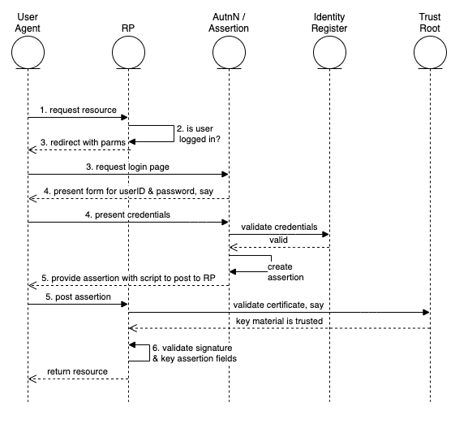

# Abstract
This article describes a single use-case as implemented in a particular architecture to illustrate a set of components and how they are connected and interact to perform the use-case.

# Introduction
# Terminology

User Agent	The user is not shown here, although he or she is operating the browser, which is called the user -agent.

# Use Case

## Summary
The web user seeks resources at the relying party, which causes the user to authenticate  to the identity provider,  which then produces an authentication assertion and the relying party consumes the assertion to establish a security context for the web user.
## Architecture Types
Cloud Environments 
## Actors 
User
User Agent (the browser)
## Components and connectors  
Audit Repository AuthN / Assertion (part of IDP) Identity Register Relying Party (RP) Trust Anchor 
## Assumptions
User wishes to access a protected resource.

## Preconditions

Relying party has already been configured to use a single identity provider.

## Postconditions

User is logged into the relying party's site.

## Basic Course of Events

The following shows the "happy path", without errors.  

1. User selects the login function on the RP's site.  Possibly this is automatic when user attempts to access the protected resource.
2. RP determines that the user is not logged in.  
3. Since there is a single configured IDP, the RP prepares an Authentication Request message. and sends it to the IDP through the user agent using an HTTP redirect (with parameters)
4. The IDP identifies and authenticates the user, interacting with the user-agent.
5. The IDP prepares a Response message, which the IDP signs.  It is then sent back to the user-agent with instructions to use an HTTP POST to forward it to the RP.
6. The RP validates the Response and interprets its contents. The signature must be checked.  Before further processing the RP checks it against the already active assertions to prevent replay. The RP then determines whether the authentication was successful.
7. Not shown in the chart is the audit records being written.  These should be written by the various components.

## Alternative Paths

It is possible that the relying party supports several service providers so a method to determine which one to use is needed in that case. 

There are alternatives to the post method in step 5.  See the specificiation [Oasis]

This is the service provider (the relying party) initiated variant. There is an also an IDP initiated alternative.

## Exception Paths

Failure to autheniticate at the IDP does not return an assertion.  

Failure to validate the signature indicates that the assertion should not be honored.

## Sequence or Collaboration Diagram

{width="6.268055555555556in" height="4.636805555555555in"}

## References

http://docs.oasis-open.org/security/saml/v2.0/saml-profiles-2.0-os.pdf

https://www.w3.org/TR/xmldsig-core/#sec-CoreValidation
