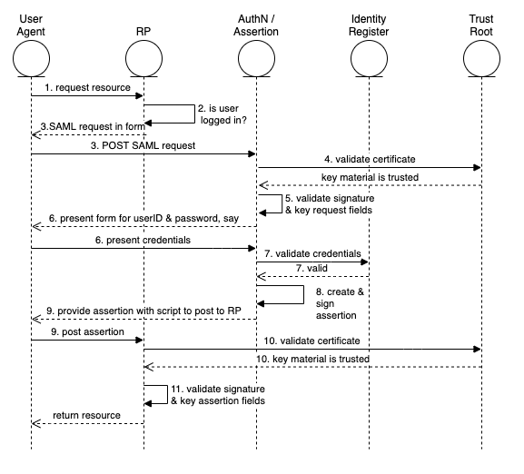

# Abstract
This is one of a set of articles that illustrate a set of abstract components may be implemented in a particular architecture.  These articles describe how the abstract components defined in the reference architecture [ref-arch] interact to perform a single use-case . This particular article describes a common use-case which allows a service (the relying party) to use the authentication capability of an identity provider, using the mature security assertion markup language (SAML) standard. This article focuses on  a specific method of web-based signal signon-on.  

# Introduction

This popular use-case relies on trust between the identity provider and the relying party.  There are various ways of doing this; this article assumes that the trust is based on the use of public key cryptography, which involves exchanging certificates.

The SAML specification defines three different kinds of assertion statements; this article is about the Authentication assertion only.

The SAML specification supports mapping of identities between different names, or federated identity. This article is restricted to a single domain, such as a comercial entity which is providing access for its employees to services provided by vendors.  In other words, a single domain of administration allows for the user identifiers to be shared.

Even a cursory review of the OASIS SAML standards documents [SAML Technical Overview] will reveal an extremely rich and flexible structure.  This article represents a very thin slice of its possiblities focusing on the run-time aspect of authentication using the web (HTTPS) messaging protocol.  Technically, we are discussing what OASIS calls the Web Browser SSO profile, using the POST binding.

This synopsis stresses the importance of the Trust Root.  The messaging between the IDP and RP passes through the User Agent.  The User Agent must be considered untrusted.  This means that a corrupted agent could potentially modify the messages.  To protect against this the messages are protected by a digital signature, which must be validated.  It is the common certificate authority that acts as the Trust Root to support these signatures.  

The topic of signatures becomes quite deep quickly and is not covered in detail here.  The SAML specification relies on the W3C Recommendation XML Signature Syntax and Processing [xml-sig], which may be of interest.

# Terminology

Please see the terminology in the reference architecture article [link].

User Agent	The user is not shown here, although he or she is operating the browser, which is called the user -agent.

# Use Case

## Summary
The web user seeks resources at the relying party, which causes the user to authenticate  to the identity provider,  which then produces an authentication assertion. Subsequently the relying party consumes the assertion to establish a security context for the web user.
## Architecture Types
Of the types defined in [Introduction to IAM Architecture] this method applies to Cloud Environments.
## Actors 
The user is the only actor.  The user acts through the User Agent (the browser).  The other participants in the use-case are systems "actors", which we show as components.
## Components
Theh following components are defined in [ref-arch]

- Audit Repository
- AuthN / Assertion (part of IDP)
- Identity Register
- Relying Party (RP)
- Trust Anchor 

## Assumptions
The user wishes to access a protected resource and has requested that access via a web browser, the User Agent.

The relying party has a single identity provider. It is possible that the relying party supports several service providers so a method to determine which one to use would be needed in that case. 

## Preconditions

Prior establishment of trust between the identity provider and the relying party. "The primary mechanism is for the relying party and asserting party to have a pre-existing trust relationship which typically relies on a Public Key Infrastructure (PKI). While use of a PKI is not mandated by SAML, it is recommended." [SAML Technical Overview]

The identity provider and the relying party are using the same user identifiers. The SAML specification establishes ways to map these, but we don't discuss this subject here.

## Postconditions

User is logged into the relying party's site.

## Basic Course of Events

The following shows the "happy path", without errors.  See also the sequence diagram, below.

1. User selects the login function on the RP's site.  Possibly this is automatic when user attempts to access the protected resource.
2. RP determines that the user is not logged in.  
3. The RP prepares an Authentication Request message, which the RP signs. It is delivered to the user agent as a form targeted at the identity provider, which is known since there is a single configured IDP. The user agent (automatically via a client side script)  sends the request to the IDP.
4. The IDP ensures the signing certificate from the RP is still valid, by checking for revocation. 
5. The IDP validates the request and interprets its contents. The signature is checked and some field values are checked.
6. The IDP interacts with the user-agent to gather the user's identifier and credentials.  For example this could ask for a user name and password, but it could be something else.
7. The IDP uses its Identity Register to validate the credentials.
8. The IDP prepares a Response message, which the IDP signs.  
9. The response is then sent back to the user-agent with instructions to use an HTTP POST to forward it to the RP.
10. The RP ensures the signing certificate from the IDP is still valid, by checking for revocation.
11. The RP validates the Response and interprets its contents. The signature must be checked.  The RP checks it against the already active assertions to prevent replay, and makes other checks. The RP then determines whether the authentication was successful.
12. Not shown in the chart is the audit records being written.  These should be written by the various components.

## Alternative Paths

Step 3 may be replaced with an HTTP redirect.  This is an allowed composition of the POST binding and the Redirect binding [bindings section 3.5]

There are also alternatives to the post method in step 5.  [binding]

This is the service provider (the relying party) initiated variant. There is an also an IDP initiated alternative.

## Exception Paths

Failure to autheniticate at the IDP does not return an assertion.  

Failure to validate the signature indicates that the assertion should not be honored.

Various error conditions such as the validity period expiring are described in the standard.

## Sequence Diagram

{width="6.268055555555556in" height="4.636805555555555in"}

## References

[SAML Technical Overview] https://www.oasis-open.org/committees/download.php/27819/sstc-saml-tech-overview-2.0-cd-02.pdf which points to more detailed documents such as the core, profiles and bindings.

[Introduction to IAM Architecture] https://www.oasis-open.org/committees/download.php/27819/sstc-saml-tech-overview-2.0-cd-02.pdf

[ref-arch] to be published concurrently in idpro bok*			

[saml-core] https://docs.oasis-open.org/security/saml/v2.0/saml-core-2.0-os.pdf

[saml-profiles] http://docs.oasis-open.org/security/saml/v2.0/saml-profiles-2.0-os.pdf

[binding] http://docs.oasis-open.org/security/saml/v2.0/saml-bindings-2.0-os.pdf

[xml-sig] https://www.w3.org/TR/xmldsig-core/#sec-CoreValidation
