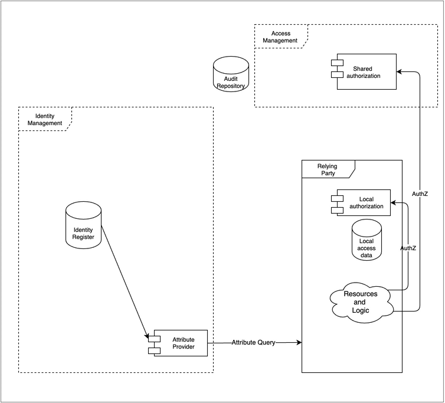

IAM Reference Architecture Model
================================

Abstract
--------

This document provides a reference model to organize the presentation of technical details associated with various implementations of identity and access management (IAM) architectural concepts. This article provides the set of generic components which are exemplified in subsequent articles with focus on specific technical use-cases. Each such use-case indicates which of the abstract components comprise a particular implementation (during the draft phase of this document an appendix is provided to elaborate on these use-cases).

The model is a restatement/extension of the ISO/IEC framing., Some UML detail has been removed for simplicity. The IAM model has been extended so that authorization, governance and risk-control can be included.

The model has been reviewed in conjunction with the FICAM, Internet 2, and NIST Zero Trust frameworks.

Introduction
------------

The following is the basic organization of an identity management system, supporting multiple relying services.

{width="6.268055555555556in" height="4.636805555555555in"}

The most basic function of the identity system is to provide secure storage of the information about identities and a way for relying services to use that data to control access to resources. Note that the term Relying Service is used to encompass all types of components that use identity services, including systems, sub-systems, and applications, independent of the domain or operator. The audit repository is shown since that is perhaps one of the most salient aspects of providing that security.

While, it is possible to have an identity management system that is populated without attaching to an external data service, this is typically not the case. Usually, employee or customer data needs to be imported.

The model can be used at different levels. For instance, a modern architecture may have a web-hosted application that calls an Identity as a Service (IDaaS) cloud identity service, acting as the Identity Management System.

In another example, a computer's file system provides access control based on the user information acquired at login. Despite both the file system and the identity management function being encapsulated in an operating system, the model holds.

More detail is provided in the next sections.

Terminology
-----------

### Identity Management System (IMS)

A set of policies, procedures, technology, and other resources for maintaining identity information. In this model it contains information about principals/subjects including credentials. It also including other data such as meta data to enable interoperability with other components.

### Relying Service (RSVC)

A component, system or application that uses the IMS to identify its users. The RSVC has its own resources and logic. This roughly corresponds to the Agency Endpoint in the FICAM model, or to Identity Consumers in the Internet2 model.

### Authoritative Sources (ASRC)

This represents one or more data sources that are used by the IMS as the basis for the master set of principal/subject identity records. Each AS may supply a subset of records and a subset of attributes. This corresponds to Identity Information Source in ISO/IEC 24760-2, and Identity Sources in Internet 2

### Principal& Credential Mgmt (PCM)

This follows the ISO model where the proofing, and lifecycle aspects of the principal (or subject) together with the process of credentialing are considered a subfunction of the IMS. FICAM separates this into a first-class component called Credential Management System, which also includes PKI information for federation, which this model indicates under metadata and discovery.

### Authentication (AUTHN)

The act of determining that the principal/subject is authentic to a level of assurance. In this model this is shown as a collaborative activity between the IMS and the RSVC. The FICAM model, at a more abstract level, includes this in the first-class component called Access Management.

### Session (SESS)

A period of time after an authentication event when an RSVC grants access to the principal/subject.

### Authorization (AUTHZ)

Authorization is how a decision is made to allow someone to access a resource. This is not included in the ISO or Internet 2 models. The FICAM framework includes this as a subcomponent of the Access Management System and is more explicit about the location of the implementation of the authorization

### Access Governance (AGOV)

Access Governance provides oversight and control over access rights implemented by relying systems using dedicated or shared authorization systems. This roughly corresponds to the Access Certification section of the first-class component Governance Systems in the FICAM model. AG is not specifically addressed in the ISO/IEC model.

### Risk Context (RCTX)

Risk Context consists of additional facts that can be brought to bear to improve the overall security of the ecosystem. Internal or external events and facts can be applied to enable, limit, or terminate access. This is similar to the section Monitors and Sensors under FICAM\'s Governance Systems, and, NIST 800-207 (Zero Trust) to many of the inputs of the Policy Decision Point as shown in Figure 2.

### Metadata (META)

Control data that allows the Identity Management System to recognize and trust the Relying Service. This corresponds to Relying Party data in the Internet 2 model.

Provisioning
------------

Provisioning describes how the data gets into the identity repository and how it flows further on to support authorization decisions.

Note that the Authoritative Sources for identity attributes transcend the HR system and may include the email system, phone system, training certification etc. In some cases, a company may have more than one HR system.

Also note, the notion of importing data does not necessarily mean making a physical copy of data, although it often does. The notion also supports the idea of virtualization - where the import of identity information is done at run-time.

The Identity Register could be implemented in several ways. Common methods include the use of general-purpose databases, optimized stores such directories i.e., a physical or a virtual directory.

Also shown, is the Principal and Credential Management function. This is intended to include steps needed to originate an identity (such as proofing or vetting) as well as on-going maintenance such as password reset and other credential management activities such as token provisioning. This function includes administrative activities and self-serve activities.

Also noted is the function of propagating selected information further into the ecosystem. This typically occurs when a relying services needs additional information about the users, e.g. for the purpose of access control, or personalization. The relying system makes a copy of the identity data and that is used in the application processes. A complete solution will allow for the full lifecycle including creation, update and eventual deletion of the identity data stored locally.

Not shown here, but sometimes implemented, are provisioning actions that occur on a just-in-time basis. This can happen when additional identity information is passed to a relying service in real-time to support a specific application requirement, possibly including identity attributes. A similar case involves the relying service querying the identity management system in order to acquire attributes.

{width="6.268055555555556in" height="5.839583333333334in"}

Authentication and sessions
---------------------------

Authentication is the process by which a subject's credentials are used to verify their identity. The Identity Management System checks and verifies credentials that are presented to it. Typically, the Relying Service presents the credentials on behalf of the user and receives an assessment from the IMS regarding the level of certainty that the user is authentic. There are multiple scenarios.

A common pattern is to associate the authentication event with the start of a session. The session is mostly the concern of the relying system. However, it is sometimes desirable to keep the sessions supported by several relying parties in synch. For instance, logging out of one session will terminate concurrent sessions. To do this, often the Identity Management System will act to orchestrate sessions termination. In high security environments, session management must support termination based on real-time identity data such as when a user's entitlements have been modified.

Another important concept is step-up authentication. A session can keep track of the level of assurance of a particular authentication, so when a user requests access to a transaction or application requiring a higher level of identity assurance, the Identity Management System can be prepared to determine the course of action. The detection of the assurance gap and subsequent action could be done at the relying system, but that would end up with a poor user experience if multiple relying systems with step-up needs were in play.

The existence of a centralized point of view about sessions, can be leveraged to support good security practices. For example, if the identity attributes of a user with an active session changes and then contravenes an access control policy the session should terminate, or if session management becomes aware of a terminated account it should end any active session that the user has. This could also occur in advanced scenarios which include external risk facts. See Risk Context below.

{width="6.268055555555556in" height="4.636805555555555in"}

Authorization
-------------

Authorization models are many and diverse. The diagram illustrates two approaches for authorization.

Both approaches typically use subject attributes help determine access. These values may have been provisioned into a local store, in the Provisioning process described above. Or the values can be acquired at run-time from the Identity Management System as shown by the attribute query.

Many relying services perform authorization tasks internally. Often the fine-grained access control required by a protected resource makes this appealing. For instance, a financial management system may maintain a user's entitlements to specific functionality with the application.

Sometimes authorization is a shared resource for many relying services. This design can improve consistency of authorization decisions and supports organizations wishing to include advanced access decisions strategies such as those required by a \"Zero Trust\" access control approach, as described by NIST 800-207. Shared authorization systems typically have a consistent approach to policy such as a standardized policy language.

{width="6.268055555555556in" height="5.809027777777778in"}

Access governance
-----------------

Access Governance provides oversight and control over access rights implemented in multiple local or shared authorization systems. These may rely on user attributes such as group memberships or roles stored in an Identity Register.

Typically, governance activities review and may modify the data in one or more of the authorization components in order to effect a change in entitlements.

Access Governance is required in enterprise systems focusing on management of staff (employee/contractor) entitlements. The concept can also apply to customer facing scenarios such as business to business delegated rights or business to customer scenarios where delegation such as power of attorney or other agents are required.

{width="6.268055555555556in" height="5.809027777777778in"}

Risk Context
------------

Risk context information can be valuable to improve the security of the relying service. External events may be visible to the Identity Management System operator through consortia or vendor packages. In some mutual-support scenarios, it may be possible for the IMS operator to also publish events for the benefit of others, supporting a relying party's risk management requirement.

Events need to be delivered into the Identity Management System so that they can selectively be used to modify the behavior of the authentication function. In some severe scenarios it may be desirable to attach the events to the session management function so that current sessions can be reviewed and terminated if needed.

As shown in the diagram, shared authorization systems may consume risk data as well. For example, an authorization might be denied if the subject\'s recent activity history is outside of normal bounds, possibly indicating a compromised credential. Logically this could happen with local authorization as well, but this is not shown.

The linkage from the IMS Audit Repository illustrates that the Risk Context consumes one or more inputs to the trust algorithm. (See NIST 800-207).

{width="6.268055555555556in" height="5.815277777777778in"}

Metadata and Discovery
----------------------

Metadata refers to control data that allows the Identity Management System to recognize and trust the Relying Service. The inverse is also true, but the metadata of the Relying System is not shown diagrammatically. This may include information that limits the types of interactions and scope of the data that is exchanged. It can also contain security information to allow the counterparties to authenticate each other. For instance, public key components such as certificates with a common trust root may be used.

Discovery is a service relying parties need to identify where a user's identity data resides. A Discovery service can advise where specific data can be accessed and which end-points are maintained to allow a relying party to query the correct repository for the required information.

{width="6.268055555555556in" height="4.636805555555555in"}

References
----------

1.  ISO/IEC 24760-2:2015(E)

2.  FICAM [[https://playbooks.idmanagement.gov/arch/components/]{.underline}](https://playbooks.idmanagement.gov/arch/components/)

3.  Internet 2 [[https://playbooks.idmanagement.gov/arch/components/]{.underline}](https://playbooks.idmanagement.gov/arch/components/)

4.  NIST Zero Trust [[https://nvlpubs.nist.gov/nistpubs/SpecialPublications/NIST.SP.800-207.pdf]{.underline}](https://nvlpubs.nist.gov/nistpubs/SpecialPublications/NIST.SP.800-207.pdf)

Appendix - Use Cases
--------------------

Each article describes a single use-case as implemented in a particular architecture to illustrate a set of components and how they are connected and interact to perform the use-case. These articles are grouped by the functions defined in the model.

To retain context from \"Introduction to IAM Architecture,\" IDPro Body of Knowledge\" the article will indicate what architecture type(s) the use case applies to.

The use-case articles follow a common structure:

-   Use-case name

-   Architecture Type or types Host, Client-Server, N-tier, Hub & Spoke, Remote Access, Cloud Environments

-   Short description

-   Actors, components and connectors included (with a diagram).

    -   The components and connectors refer to the abstract architectural components and their implementations in this use-case.

-   Prerequisites

-   Exposition on how the components work together and some level of detail deemed by the author appropriate for the reader

-   Where to find more information on this and adjacent use-cases

Example: of a use-case. This example is chosen to indicate how constrained these articles are intended to be. There could be quite a few variations on Windows login.

Name: Employee logs in to Windows domain - Kerberos Short Description: Interactive domain login using password (Kerberos) Architecture Type: Client-Server Description: An existing employee logs into the corporate Windows environment with a password. Actors/Components: User (employee), network attached computer running Windows 10, Microsoft Active Directory (IDENTITY REGISTER), Kerberos protocol (AUTHENTICATION)

### List of use-cases

The list of use-case articles is intended to grow over time. \[seeded 5/20/21 - discuss with cmte for more\]

#### Function: Authentication

1.  Employee logs in to Windows domain - Kerberos

2.  Customer logs in from web browser - OpenID Connect

3.  Cloud service authenticates via delegation - SAML

#### Function: Provisioning

1.  Directory absorbs changed people information from HR - LDAP

2.  Directory synchronizes with downstream resource - SCIM

#### Function: Attribute Exchange

1.  Attributes are provided in assertion - SAML

2.  Attributes are requested - OpenID Connect

#### Function: Authorization

1.  File system authorizes access - Windows

2.  Application authorizes based on attributes - custom

3.  Application delegates to policy service - OAuth

4.  Cloud service authorizes based on role assumed from single signon - Cloud
